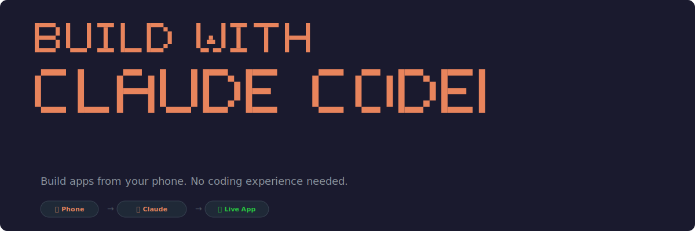

<p align="center">
  
</p>

# Build With Claude

**A step-by-step guide for non-technical people to build apps from their phone.**

You don't need to know how to code. You don't need to have all the answers. You just need a Mac, a phone, and curiosity.

This guide walks you through setting up Claude Code with Telegram so you can describe what you want to build — from your phone — and watch it happen.

---

## Quick Start

Open Terminal on your Mac and paste this:

```bash
bash <(curl -fsSL https://raw.githubusercontent.com/kevinmmiddleton/build-with-claude/main/setup.sh)
```

This single command installs everything you need. When it's done, follow the on-screen instructions.

---

## What Gets Installed

| Tool | What It Does | Cost |
|------|-------------|------|
| **Bun** | Runs Claude Code | Free |
| **Claude Code** | The AI that builds your apps | Requires [Claude Pro/Max](https://claude.ai) subscription |
| **Terminal shortcut** | Added to your Dock for easy access | Free |
| **Auto-start** | Claude + Telegram starts when your Mac turns on | Free |

## What You'll Set Up (Accounts)

The setup script handles the tools. You'll create these accounts yourself — all have free tiers:

| Service | What It's For | Link |
|---------|--------------|------|
| **Claude.ai** | Your AI builder | [claude.ai](https://claude.ai) |
| **GitHub** | Where your code lives | [github.com](https://github.com) |
| **Telegram** | How you talk to Claude from your phone | [telegram.org](https://telegram.org) |
| **Supabase** | Your app's database and auth | [supabase.com](https://supabase.com) |
| **Vercel** | Puts your app on the internet | [vercel.com](https://vercel.com) |
| **Sentry** | Catches errors in your app | [sentry.io](https://sentry.io) |
| **Stripe** | Payments (when you're ready) | [stripe.com](https://stripe.com) |
| **Resend** | Sends emails from your app | [resend.com](https://resend.com) |

You don't need all of these on day one. Start with Claude.ai, GitHub, Telegram, Supabase, and Vercel. Add the rest as your app needs them.

---

## The Full Guide

### Chapter 1: Before You Start

**What you need:**
- A Mac (Mac Mini, MacBook, iMac — any Mac works)
- The Mac needs to stay on. Claude Code runs on your computer, so when it's off, your Telegram bot goes to sleep. A Mac Mini on a desk is ideal.
- A phone with Telegram installed
- A [Claude.ai](https://claude.ai) account (Pro or Max plan)

**Why does my Mac need to stay on?**

Claude Code runs locally on your machine. When you send a message on Telegram, it goes to your Mac, Claude processes it, writes code, and pushes it to the internet. Your Mac is the brain. If it sleeps, the brain sleeps.

The setup script configures your Mac to stay awake when plugged in. Display still sleeps after 30 minutes to save energy.

### Chapter 2: Run the Setup Script

Open Terminal. It's in your Applications > Utilities folder, or just search for "Terminal" in Spotlight (Cmd + Space).

Paste this and press Enter:

```bash
bash <(curl -fsSL https://raw.githubusercontent.com/kevinmmiddleton/build-with-claude/main/setup.sh)
```

The script will:
1. Install Bun (the engine that runs Claude Code)
2. Install Claude Code
3. Add Terminal to your Dock
4. Add helpful shortcuts to your terminal
5. Prevent your Mac from sleeping when plugged in
6. Set up Claude to auto-start with Telegram on login

### Chapter 3: Sign In to Claude Code

Open a **new** Terminal window (so the shortcuts load), then type:

```bash
claude
```

Follow the prompts to sign in with your Claude.ai account. Once you're in, you'll see Claude's interface. Type `/quit` to exit for now.

### Chapter 4: Set Up Your Telegram Bot

1. Open **Telegram** on your phone
2. Search for **@BotFather** (Telegram's official bot maker)
3. Send: `/newbot`
4. Choose a name (e.g., "My Claude Bot")
5. Choose a username (must end in "bot", e.g., "myname_claude_bot")
6. BotFather gives you a **token** — copy it

Now go back to Terminal on your Mac:

```bash
claude
```

Inside Claude Code, type:

```
/telegram:configure
```

Paste your bot token when asked. Then set up access:

```
/telegram:access
```

Follow the prompts to pair your Telegram account.

### Chapter 5: Start Building

Start Claude with Telegram:

```bash
start-claude
```

Now open Telegram on your phone and message your bot. Try:

> "Create a new React app with Supabase auth. Deploy it to Vercel."

Watch your Mac's Terminal. Claude will:
1. Create the project
2. Write the code
3. Push it to GitHub
4. Vercel auto-deploys it
5. Reply on Telegram with the live URL

**That's it. You just built an app from your phone.**

### Chapter 6: Your Accounts Cheat Sheet

As you build, Claude will need API keys for various services. Here's how to get them:

**Supabase** (database + auth):
1. Go to [supabase.com](https://supabase.com), sign up
2. Create a new project
3. Go to Settings > API
4. You need: Project URL, anon key, service role key

**Vercel** (deployment):
1. Go to [vercel.com](https://vercel.com), sign up with GitHub
2. That's it — Vercel auto-deploys from GitHub

**Sentry** (error tracking):
1. Go to [sentry.io](https://sentry.io), sign up
2. Create a project (choose React)
3. You need: the DSN string

**Stripe** (payments):
1. Go to [stripe.com](https://stripe.com), sign up
2. Go to Developers > API keys
3. Start with test keys (no real charges)

**Resend** (email):
1. Go to [resend.com](https://resend.com), sign up
2. You need: API key

Store these in a `.env` file in your project. Tell Claude: "Save my Supabase keys to .env" and it'll set it up.

---

## Shortcuts

After setup, you have these commands in Terminal:

| Command | What It Does |
|---------|-------------|
| `start-claude` | Starts Claude Code with Telegram |
| `update-claude` | Updates Claude Code to the latest version |
| `claude` | Opens Claude Code (without Telegram) |

---

## Troubleshooting

**"My bot isn't responding on Telegram"**
- Is your Mac on and awake?
- Is Claude Code running? Open Terminal and type `start-claude`
- Did you pair your Telegram account? Type `/telegram:access` inside Claude Code

**"Command not found: claude"**
- Open a **new** Terminal window (the old one doesn't have the updated shortcuts)
- If it still doesn't work, run: `export PATH="$HOME/.bun/bin:$PATH"`

**"Command not found: bun"**
- Run: `curl -fsSL https://bun.sh/install | bash`
- Open a new Terminal window

**"I don't know what to build"**
- Start simple: "Build me a personal website with my name and a bio"
- Or: "Create a to-do app where I can add and check off tasks"
- Or: "Make a link saver where I can paste URLs and tag them"
- You can always add features later. Start small.

**Something else went wrong?**
- The setup script logs errors automatically to `~/.claude/setup-errors.log`
- [Open an issue](https://github.com/kevinmmiddleton/build-with-claude/issues/new?template=setup-error.md) and paste the log — we'll help you fix it

---

## Glossary

| Term | What It Means |
|------|--------------|
| **Terminal** | The app on your Mac where you type commands. Think of it as a text-based way to talk to your computer. |
| **Repository (repo)** | A folder for your project that lives on GitHub. It keeps track of every change. |
| **Deploy** | Putting your app on the internet so anyone can use it. |
| **Environment variable (.env)** | A secret value (like an API key) that your app needs but you don't want to share publicly. |
| **API key** | A password that lets your app talk to a service (like Supabase or Stripe). |
| **Push** | Uploading your code changes to GitHub. |
| **Commit** | Saving a snapshot of your code with a description of what changed. |
| **Free tier** | Most services let you use them for free up to a certain limit. More than enough to get started. |

---

## What This Costs

| Item | Cost |
|------|------|
| Claude Pro subscription | $20/month |
| Claude Max subscription | $100/month (higher usage limits) |
| GitHub | Free |
| Supabase | Free tier (generous) |
| Vercel | Free tier (generous) |
| Sentry | Free tier |
| Stripe | Free until you process real payments |
| Resend | Free tier (100 emails/day) |
| Telegram | Free |
| **Total to get started** | **$20/month** |

---

## What's Next

Once you've built your first app:

- **Add features**: Message Claude on Telegram: "Add a dark mode toggle" or "Add user profiles"
- **Fix bugs**: Screenshot the bug, send it to Claude: "This is broken, fix it"
- **Share it**: Your Vercel URL works for anyone. Send it to friends.
- **Learn as you go**: You don't need to understand the code. But you will start to, naturally.

The best way to learn is to build something you actually want.

---

*Built by [Kevin Middleton](https://github.com/kevinmmiddleton). Questions? Open an issue.*
